# Pharmagen — Internal Workflow Reference

> How every mode of the software works **under the hood**, end to end.
>
> This document is the narrative companion to [`WORKFLOW_Schema.mmd`](WORKFLOW_Schema.mmd)
> (a single Mermaid master diagram) and [`WORKFLOW.canvas`](WORKFLOW.canvas)
> (an Obsidian whiteboard of the same flows). Read this for the *why*; open the
> canvas for the *at-a-glance map*.

---

## Table of contents

1. [System overview](#1-system-overview)
2. [Entry points & dispatch](#2-entry-points--dispatch)
3. [The shared engine backbone](#3-the-shared-engine-backbone)
4. [Workflow — Library building (offline)](#4-workflow--library-building-offline)
   - [4.1 Drug graphs](#41-drug-graphs-smiles--molecular-graph)
   - [4.2 Gene-variant graphs](#42-gene-variant-graphs-vcftsv--topology-graph)
5. [Workflow — Standard training](#5-workflow--standard-training)
6. [Workflow — Optuna hyperparameter optimization](#6-workflow--optuna-hyperparameter-optimization)
7. [Workflow — Prediction / inference](#7-workflow--prediction--inference)
8. [Workflow — FastAPI serving](#8-workflow--fastapi-serving)
9. [Workflow — NGS bioinformatics pipeline](#9-workflow--ngs-bioinformatics-pipeline)
10. [Cross-cutting concerns](#10-cross-cutting-concerns)
11. [Artifact & data-flow summary](#11-artifact--data-flow-summary)

---

## 1. System overview

**Pharmagen** maps a patient's *(drug, genotype)* pair to phenotypic outcomes
using a **Two-Tower Graph Neural Network** (GATv2, PyTorch Geometric):

- **Drug tower** — molecular graphs derived from SMILES (RDKit): 61 node / 18 edge features, plus a per-molecule **global descriptor vector** (14 QSAR physicochemical descriptors + 1024-bit ECFP4) and a predicted **ADMET profile** (41 endpoints via ADMET-AI), both fused into the embedding.
- **Genotype tower** — variant-topology graphs built from VCF/TSV, validated against GRCh38. 9 node features, 3 edge features.
- The two graph embeddings are fused and routed into **multi-task heads** sized by `target_dims`.

Everything the software does falls into one of six workflows:

| Workflow | Trigger | Online / Offline | Produces |
|---|---|---|---|
| **Library build** | `python -m src.data.library` | Offline (one-time) | `data/library/*.pt` graph cache |
| **Standard training** | `--mode train` | Offline | checkpoint + encoder bundle |
| **Optuna tuning** | `--mode train --optuna` | Offline | best params + study DB + plots |
| **Prediction** | `--mode predict` / menu | Online | per-target labels (CSV) |
| **FastAPI serving** | `uvicorn src.api.main:app` | Online | JSON predictions over HTTP |
| **NGS pipeline** | `src.genomics.ngs_pipeline` | Offline | VCF/annotations from raw reads |

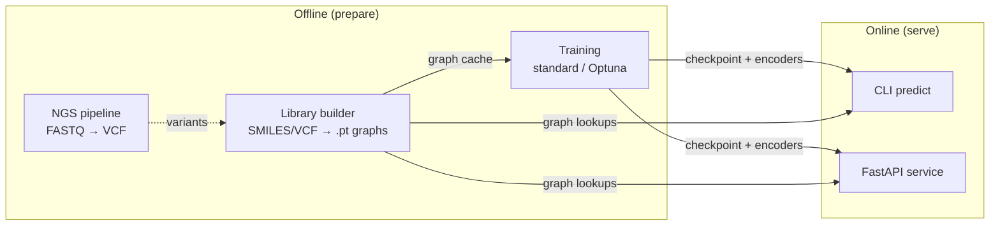

---

## 2. Entry points & dispatch

There are **three** ways into the software; all of them ultimately reuse the
same engine helpers (§3).

| Entry point | File | Purpose |
|---|---|---|
| CLI / interactive menu | `main.py` | Human-facing orchestrator |
| Library builder CLI | `src/data/library/__main__.py` | Offline graph generation |
| HTTP service | `src/api/main.py` | Programmatic inference |

`main.py` parses arguments, configures logging once via
`src.core.setup_logging`, then dispatches on `--mode`:

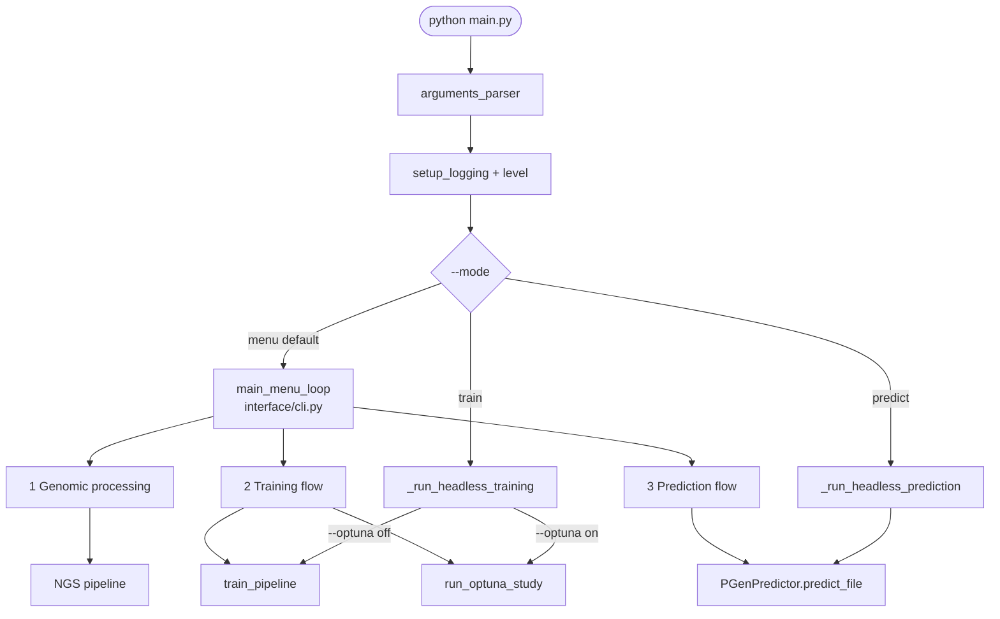

**Key detail:** heavy imports (`torch`, `PGenPredictor`, `train_pipeline`) are
imported *lazily* inside each branch so that simply opening the menu — or hitting
`/health` on the API — never pays the multi-second torch import cost.

---

## 3. The shared engine backbone

`src/model/engine/base.py` is the **single source of truth** for the bootstrap
steps that training, tuning, and inference all need. No engine re-implements
device selection, dataset wiring, or model construction — they call these pure
helpers.

| Helper | Responsibility |
|---|---|
| `resolve_device(override)` | CUDA if available (or explicit override), else CPU |
| `extract_tower_dims(cfg)` | Nested `{drugs/geno: {features, edges, attrs}}` dim spec from `cfg.extras` |
| `load_and_clean_data(csv, cfg)` | `TabularLoader` → `PharmacogenomicCleaner`, validates columns + missingness |
| `stratified_split(df, val_split)` | Train/val split honoring the `_stratify` column |
| `build_two_tower_datasets(...)` | Paired train/val `DoubleTowerDataset` with **shared** encoders |
| `infer_dataset_dimensions(...)` | Probe sample[0] → `drug_dim`, `geno_dim`, `target_dims` |
| `build_train_val_loaders(...)` | `DataLoader` pair (collator, workers, pin_memory defaults) |
| `build_gnn_model(...)` | Wraps `create_gnn_model` → `PharmagenTwoTower` on device |

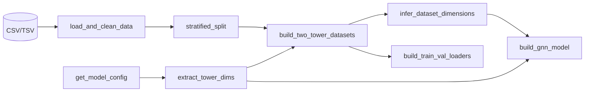

> **Why dimensions are *inferred*, not read from config:** the real feature
> widths come from the actual graphs in the library (`sample["drug_data"].x.shape[1]`).
> These inferred dims are persisted with the encoders so inference can rebuild a
> model whose `state_dict` matches the checkpoint exactly.

---

## 4. Workflow — Library building (offline)

**Command:** `python -m src.data.library [--only-gene CYP2D6] [--skip-drugs] [--force]`

This is a **prerequisite** for training and inference: it converts raw chemistry
and genomics into the on-disk `.pt` graph cache that both towers read from.

`LibraryBuilder.run()` (`src/data/library/builder.py`) owns the lifecycle: it
loads/creates a resumable **`BuildManifest`**, runs the drug builder, then the
gene builder, saving the manifest after each phase.

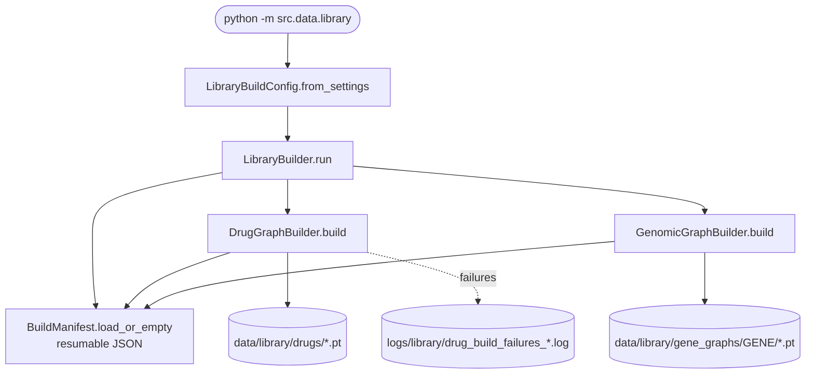

### 4.1 Drug graphs (SMILES → molecular graph)

`src/data/library/drugs.py`. The builder is **multi-format** and **resumable**.

**Input formats** (auto-detected by `load_drug_records` on file extension):

| Extension | Reader | Shape |
|---|---|---|
| `.tsv` / `.txt` | `_read_drugs_tabular(sep="\t")` | columns `cid, smiles, cmpd_name_cleaned` |
| `.csv` | `_read_drugs_tabular(sep=",")` | same columns |
| `.json` | `_read_drugs_json` | flat `{cid: smiles}` map (no name column) |

Each record is normalized to `{cid, smiles, name}`; raw values stay raw so the
build loop can categorize bad rows.

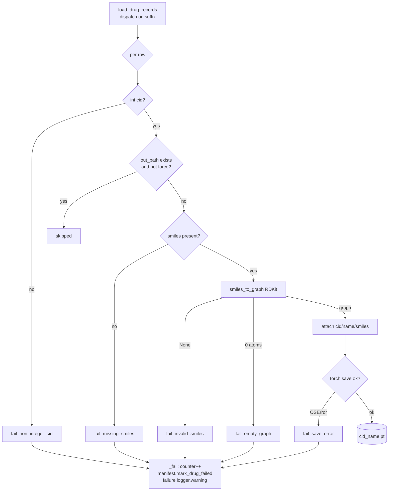

**Graph schema (must match `models.toml` and the trained drug tower).** Every
categorical field carries an explicit "other" / full vocabulary and every
continuous field is normalised, so out-of-vocabulary values are never silently
encoded as all-zeros (saturation ≈ 0 on the real catalog):
- **Node (61):** element one-hot[C,N,O,S,P,F,Cl,Br,I,B,Se,Si,other], degree[0..6],
  total-valence[0..6], formal-charge (scalar + one-hot[-1,0,+1,other]),
  hybridization[SP,SP2,SP3,SP3D,SP3D2,S,other], total-Hs[0..4],
  chirality[unspec,CW,CCW,other], `is_aromatic`, `is_in_ring`,
  ring-size membership[3..7], Gasteiger partial charge, Pauling electronegativity,
  `is_H_donor`, `is_H_acceptor`, normalised mass, radical electrons.
- **Edge (18):** bond-type one-hot[single,double,triple,aromatic,other],
  `is_conjugated`, `is_in_ring`, ring-size membership[3..7],
  stereo one-hot[none,Z,E,cis,trans,other]. Edges are **bidirectional**.

- **Global (1038), attached as `global_feats` [1,1038]:** 14 normalised QSAR
  physicochemical descriptors (MolWt, LogP, TPSA, HBD/HBA, rotatable bonds,
  FractionCSP3, ring counts, heteroatoms, QED, stereocentres) + a Morgan/ECFP4
  fingerprint (1024 bits). Computed per molecule and **fused into the drug
  embedding** by `PharmagenTwoTower` (`drug_global_mlp` → `drug_fuse`), so two
  structurally similar drugs land near each other — pharmacological similarity
  becomes geometric. The fused embedding keeps `embedding_dim`, so the
  interaction MLP and heads are unchanged.

- **ADMET (41), attached as `admet_feats` [1,41]:** a predicted ADMET /
  enzyme-interaction profile from **ADMET-AI** (Chemprop D-MPNN) — absorption[8],
  distribution[3], metabolism/CYP[8] (5 inhibition + 3 substrate), excretion[3],
  toxicity[19]. Classification endpoints keep their probability; regression
  endpoints use the DrugBank percentile / 100. Kept **decoupled from
  `global_feats`** (structure vs predicted PK) and consumed by a **second parallel
  branch** (`drug_admet_mlp`) fused alongside the global branch. Computed once per
  catalog and cached at `data/library/admet_profile.parquet`. See
  `src/data/library/admet.py` and `docs/ADMET_TOOLS.md`.

> Widths are kept in sync across `drugs.py` / `admet.py` (`DRUG_NODE_DIM` /
> `DRUG_EDGE_DIM` / `DRUG_GLOBAL_DIM` / `DRUG_ADMET_DIM`), `models.toml`
> (`drug_node_features` / `drug_attrs_features` / `drug_global_features` /
> `drug_admet_features`), `engine/base.extract_tower_dims`, `cache.GraphDims`,
> and `datasets.DEFAULT_DIMENSIONS`. PyG auto-batches the graph-level
> `global_feats` / `admet_feats` to `[B, 1038]` / `[B, 41]`; the empty-graph
> fallback carries zero vectors.

**Failure handling & logging.** Failures are categorized by `DrugFailureCategory`
(`non_integer_cid`, `missing_smiles`, `invalid_smiles`, `empty_graph`, `save_error`).
Each failure is:
1. counted in an in-memory `Counter` (the **nature** breakdown),
2. recorded on the manifest (so the next run retries it), and
3. emitted through a **dedicated, non-propagating `logging` logger**
   (`Pharmagen.library.drug_failures`) whose `FileHandler` writes to
   `logs/library/drug_build_failures_<date>.log`.

The run ends by logging a per-category summary line (`built / skipped / failed`
+ the breakdown) both to that file and the central log. Output naming is
`<cid>_<safe_name>.pt` (JSON inputs with no name fall back to `<cid>_cid<cid>.pt`),
which keeps the `^(\d+)_` index regex satisfied (see `graph_indexing.py`).

**One-hot saturation instrumentation.** Because the schema is frozen at 25/7,
an out-of-vocabulary value (hypervalent hybridization like `SP3D2`, `degree > 4`,
formal charge outside `[-2,2]`, monatomic-ion hybridization `S` from salt
counterions, …) is silently encoded as an **all-zeros** one-hot — real
information loss. `smiles_to_graph(smiles, saturation=...)` optionally threads a
`FeatureSaturation` accumulator that tallies these by feature
(`degree, formal_charge, hybridization, total_hs, chiral_tag, bond_type`) and by
concrete value (`hybridization=SP3D2`). The graph output is **byte-identical**;
only observability is added. The builder reports the tally on a second dedicated
logger → `logs/library/drug_feature_saturation_<date>.log` (per-drug events +
end-of-run summary), and surfaces a `WARNING` on the central log when any
saturation occurred. *Empirically, on the real catalog the bulk of saturation
comes from salt counterions* — which is the signal the salt-stripping step
(below) acts on.

**Salt / counterion stripping.** Multi-fragment SMILES (`.`-separated, e.g.
`CC(=O)[O-].[Na+]`) carry an inert counterion that would pollute the graph and
its pooling. With `strip_salts=True` (the default; CLI `--keep-salts` disables
it) `smiles_to_graph` reduces the molecule to its **largest fragment**
(`_largest_fragment`) before encoding, and the builder counts the reductions in
`salts_stripped`. Empirically this removed the bulk of the counterion saturation
(on a 4 000-drug sample: 155 salts stripped, saturation events 80 → 16); the
events that remain are genuine monatomic-ion "drugs" (`[Na+]`, `[Mg+2]`, …) with
no larger fragment, plus true hypervalent atoms — exactly what should still be
flagged. Single-fragment molecules are returned untouched.

### 4.2 Gene-variant graphs (VCF/TSV → topology graph)

`src/data/library/genes.py`. Produces one `Data` per `(gene, variant)`:

```
backbone → bb_pos → split ─[ref]──→ ref_pos ─→ merge → end
                         ╲─[alt_i]─→ alt_pos_i ─╱
```

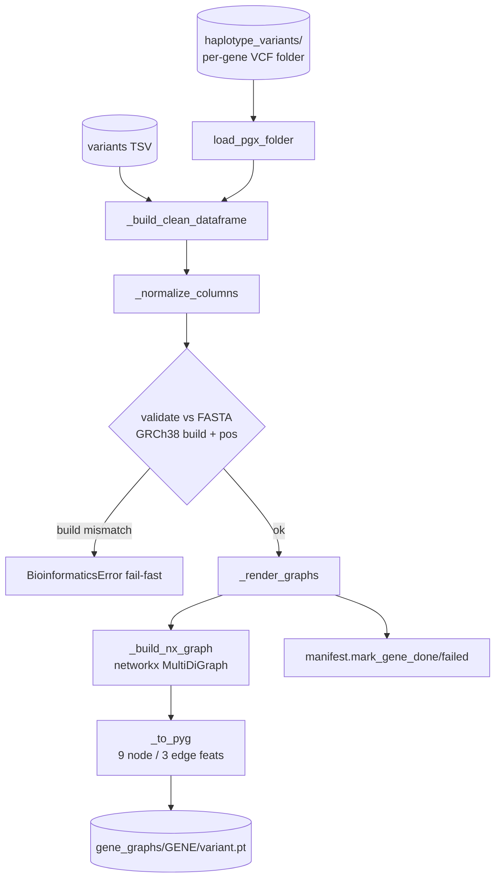

Supporting modules:
- **`pgx.py`** — reads the PharmVar-style per-gene VCF folder; filename → haplotype
  label; DPYD rsID-named VCFs are special-cased via `star_alleles.tsv`.
- **`chromosome.py`** — maps chromosome labels (`chr1`, `1`, `X`, `NC_000001.11`)
  to canonical GRCh38 RefSeq accessions for FASTA validation.
- **`organize.py`** — pure-`pathlib` mover that sorts flat `GENE_<variant>.pt`
  files into `GENE/<variant>.pt` subdirs (no shell).
- **`star_alleles`** — activity scores come from `data/dicts/star_alleles.tsv`;
  never hardcoded.

**Invariants:** coordinates are **1-based**; genome build is part of every
`Position`; a build mismatch is a **fail-fast** `BioinformaticsError`, not a warning.

---

## 5. Workflow — Standard training

**Command:** `python main.py --mode train --model TwoTowerGAT --input data/train.tsv --epochs 100`
**Orchestrator:** `src/pipeline.py::train_pipeline`

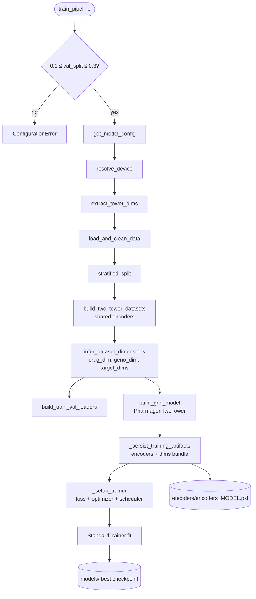

**Trainer internals** (`StandardTrainer` ⊂ `TrainingLoop`, `src/model/training/`):

- **`_maybe_compile`** — runs `torch.compile` (inductor) at construction; falls
  back to eager on failure.
- **`train_epoch`** — AMP autocast + `GradScaler`, gradient clipping (`max_norm=1.0`),
  per-task losses combined by `MultiTaskUncertaintyLoss`.
- **`validate`** — `torch.inference_mode` + autocast, no scaler.
- **Scheduler** — `ReduceLROnPlateau` stepped on validation loss.
- **Checkpointing** — on every new best val-loss, `CheckpointManager.save_checkpoint(is_best=True)`;
  `keep_last_n=3` rolling checkpoints.
- **Early stopping** — `patience` epochs without improvement.
- **NaN guard** — `_check_nan` raises `TrainingError` (standard) on a NaN loss.
- **Finish** — reloads the *best* checkpoint so the returned model is the best one.

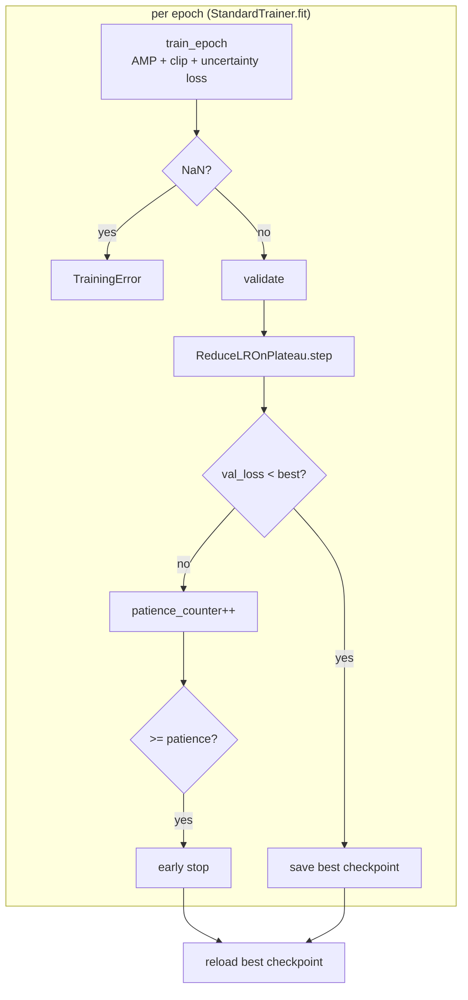

**Persisted artifact bundle** (`encoders_<model>.pkl`):

```python
{"encoders": dict[str, LabelEncoder | MultiLabelBinarizer],
 "drug_dim": int, "geno_dim": int, "schema_version": 1}
```

---

## 6. Workflow — Optuna hyperparameter optimization

**Command:** `python main.py --mode train --optuna --optuna-trials 50 --optuna-epochs 30`
**Orchestrator:** `src/model/engine/tuner.py::run_optuna_study` → `PGenTuner`

The tuner reuses the engine backbone, but loads + splits the data **once** and
keeps the datasets static across trials — only the model and the
hyperparameters change per trial.

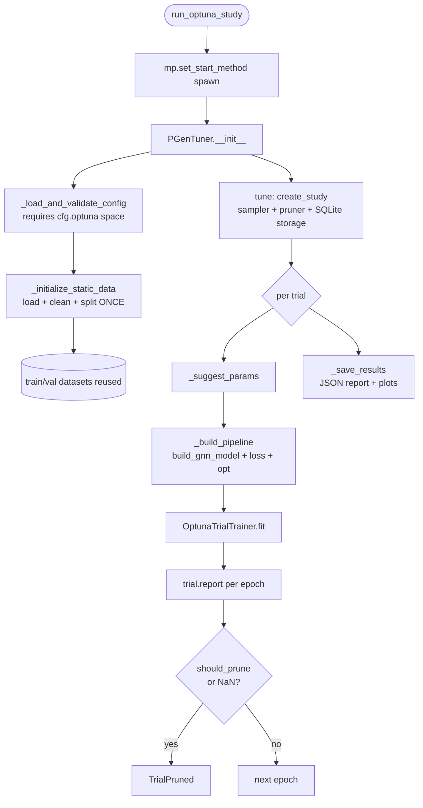

**Differences from standard training** (`OptunaTrialTrainer`):
- **No `torch.compile`** (wasted on pruned trials), **no checkpointing**.
- Reports intermediate val-loss to the trial each epoch; honors the pruner.
- **NaN → `optuna.TrialPruned`** (not `TrainingError`) so the study continues.

**Sampler / pruner:** TPE (multivariate) or Random; `PatientPruner(HyperbandPruner)`
or Median. **Storage:** SQLite at `reports/optuna/database/<study>.db`
(`load_if_exists=True` → resumable studies). **Outputs:** a JSON report with the
best trial + top-5 and (if matplotlib present) optimization-history and
param-importance PNGs under `reports/figures/`.

---

## 7. Workflow — Prediction / inference

**Command:** `python main.py --mode predict --model TwoTowerGAT --input data/test.csv`
**Engine:** `src/model/engine/predictor.py::PGenPredictor`

`PGenPredictor` loads the model, encoder bundle, and graph cache **once** per
model name; it composes the *exact same primitives* as training
(`DoubleTowerDataset`, `DoubleTowerCollater`, `PharmacogenomicCleaner`) so the
inference path can never drift from the training path.

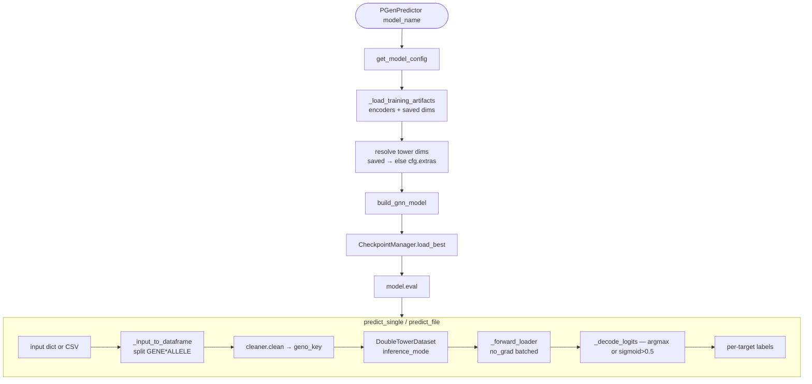

**Artifact compatibility:** `_load_training_artifacts` understands the current
**bundle** format and falls back (with a warning) to the legacy plain-dict
encoder format, in which case dims default to `cfg.extras`.

**Decoding:** single-label targets → `argmax` then `inverse_transform`
(unknown class → `"Unknown"`); multi-label targets → `sigmoid > 0.5` then
`MultiLabelBinarizer.inverse_transform`.

**CLI path:** `main.py::_run_headless_prediction` → `predict_file` → writes
`<stem>_predictions_<date>.csv` next to the input. The interactive menu
(`run_prediction_flow`) offers single-prediction and batch-file sub-flows.

---

## 8. Workflow — FastAPI serving

**Command:** `uvicorn src.api.main:app --reload --host 0.0.0.0 --port 8000`
**Factory:** `src/api/main.py::create_app`

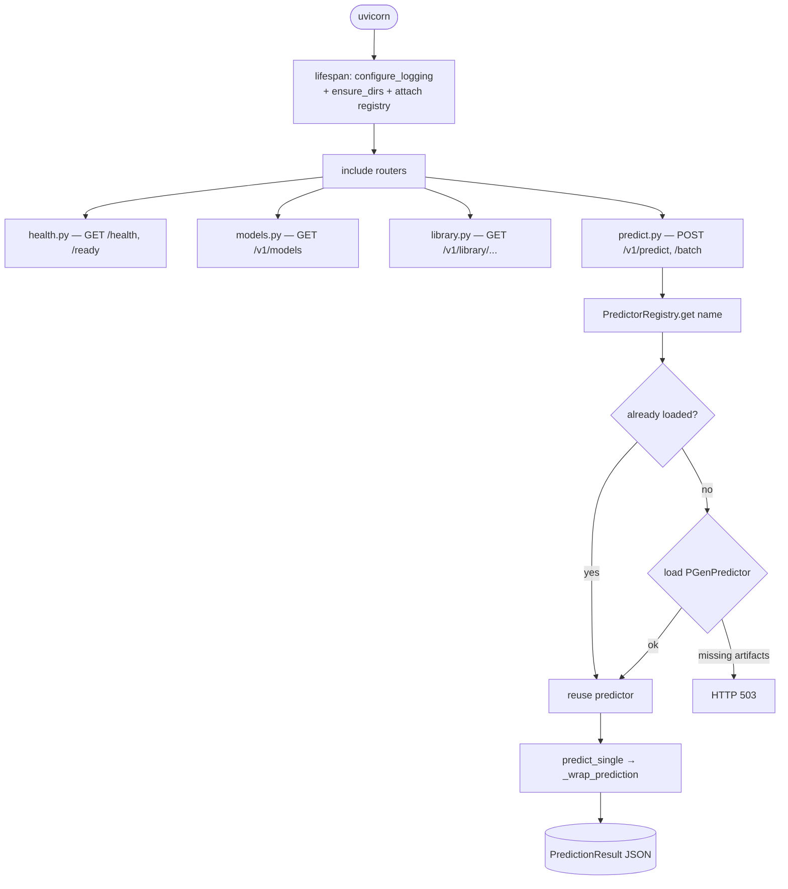

**Lazy model loading is the central design choice:** the lifespan deliberately
does **not** pre-load the model. `/health` and `/ready` answer instantly even
without trained artifacts. The first `/v1/predict` triggers a one-time, locked
load via `PredictorRegistry` (per-process cache keyed by model name); missing
artifacts surface as `503 Service Unavailable`, the expected dev/CI state.

**Endpoints:**
- `GET /health`, `GET /ready` — liveness / readiness.
- `GET /v1/models`, `GET /v1/models/{name}` — model catalog from config.
- `GET /v1/library/{drugs,genes,genes/{symbol}}` — inspect the on-disk graph library.
- `POST /v1/predict`, `POST /v1/predict/batch` — single / batch inference.

---

## 9. Workflow — NGS bioinformatics pipeline

**Module:** `src/genomics/ngs_pipeline.py` — argv-based wrappers around external
tools (no `shell=True`; pipes use `subprocess.Popen` plumbing).

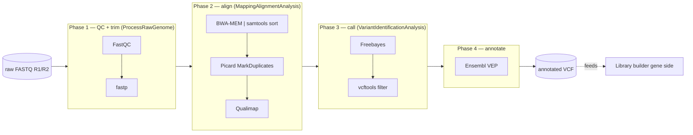

Each phase is its own class (subclass of `BioToolExecutor`), so callers can
start a sub-pipeline from already-aligned BAMs. `_run` executes an argv list and
logs the command; `map_reads` wires `bwa | samtools sort` with `Popen`.
BWA auto-indexes the reference on first use (`_check_bwa_index`).

---

## 10. Cross-cutting concerns

### Configuration (`src/config/`)
Pydantic Settings. `get_settings()` and `get_model_config(name)` are the only
sanctioned accessors. `Settings.paths` is a typed `Paths` model
(`data/`, `logs/`, `models/`, `encoders/`, `library/`, …); `paths.ensure_dirs()`
creates them. Model definitions (features, targets, hyperparameters, Optuna
search space) live in `src/config/data/models.toml` — e.g.
`features = ["drugs_cid", "genotype"]`, `targets = ["phenotype_category"]`.

### Data layer (`src/data/`)
- `loaders.TabularLoader` — CSV/TSV → Polars with a centralized schema + null tokens.
- `cleaning.PharmacogenomicCleaner` — drops missing gene/genotype, builds the
  `geno_key` join column (gene + star-allele + rsID lookup), normalizes
  multi-label columns, adds `_stratify`.
- `encoders.TargetEncoder` — fit/transform label & multi-label encoders, reused
  across train/val/inference.
- `datasets.DoubleTowerDataset` — composes `GraphCache` (graph lookup) + `TargetEncoder`.
- `cache.GraphCache` — in-RAM `.pt` store with disk fallback; corrupt/missing
  files degrade to a typed empty graph (`make_empty_graph`). Strips metadata in
  training mode (it confuses PyG batching), preserves it in inference mode.
- `collator.DoubleTowerCollater` — batches drug+geno PyG `Data` into a `Batch`.
- `graph_indexing.GraphIndexBuilder` — maps `cid`/`gene+variant` → `.pt` path
  (drug files must match `^(\d+)_`).

### Logging (`src/core/log.py`)
`setup_logging` configures the root logger once (timed-rotating file + console).
All modules do `logging.getLogger(__name__)` and inherit it. **Methodology:** all
diagnostics, progress, and failures go through `logging` — never `print`/`f.write`.
Separate audit trails (e.g. drug-build failures) use a dedicated non-propagating
logger with its own `FileHandler` (see `drugs.py::_build_failure_logger`).

### Domain & validation (`src/domain/`, `src/core/`)
Pydantic v2 models at every external boundary (HTTP, CLI, TSV rows, TOML).
Exceptions (`ConfigurationError`, `DataError`, `ModelError`, `EncoderError`,
`TrainingError`, `BioinformaticsError`) and validators live in `src/core/`.

---

## 11. Artifact & data-flow summary

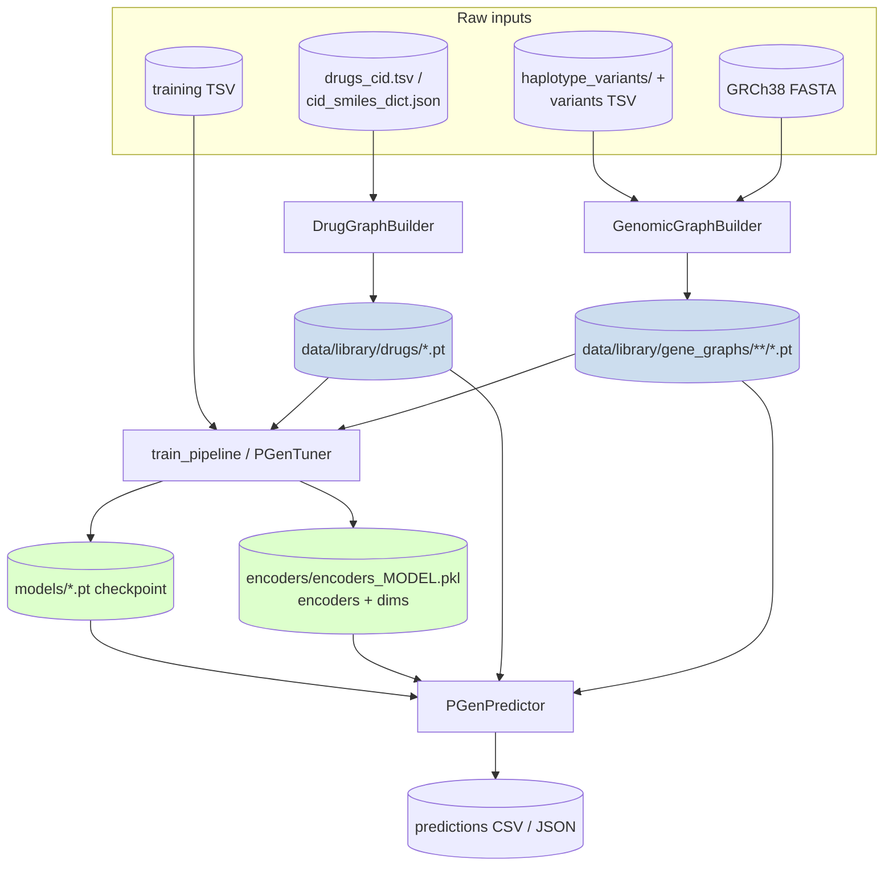

**One-line mental model:** *Build the graph library once → train (or tune) to
produce a checkpoint + encoder/dims bundle → serve predictions (CLI or HTTP) that
reuse the very same datasets, cleaner, and graph cache as training.*
